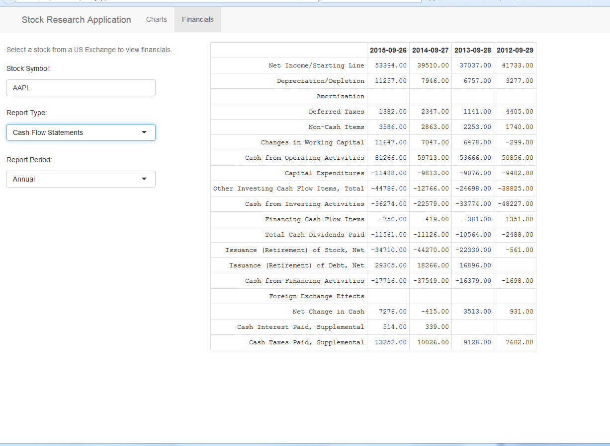

Stock Research Application  Presentation
========================================================
author:  Roderic N. Reckley 
date:  July 10, 2016
autosize: true

Stock Research Application Overview
========================================================
  
  
    For any investor, the decision to invest or sell a stock is based on performing a basic technical analysis. A technical analysis is the study of price and volume changes over time. Technical analysis usually involves the use of financial charts to help study these changes.
  
    The R development environment is a robust programming environment for Data analysis, manipulation and visualization. These capabilities make it a good tool for performing a technical analysis of a individual stock. All that is needed is access to the necessary financial data.
  
    Access to finanical data and the ability to generate the necessary charts is provided by the quantmod package. The quantmod package enables the R environment to downland financial data via http from a variety of sources and produce a varierty of technical charts. Google and Yahoo are the primary sources for obtaining the financial data. 
 

Stock Chart Generation 
========================================================

The application uses Apple Inc. (AAPL) as the defualt stock.  

The chart application allows you to:
* Select the stock symbol you wish to work with.
* The Date range to obtain the historical data assoicated with the stock.
* Chart Type.
* Select addtional technical indicators to apply to the chart.

Stock Financials Report
========================================================

The financials application allows you to:
* Select the stock symbol you wish to work with.
* Report Type.
* Report Period.

Try the application
========================================================

The stock research application is available at: https://rreckley.shinyapps.io/StockQuote/

The source code for the application is available at: https://github.com/rreckley/data-products/tree/master/StockQuote

Use the power of R to become a better investor.

